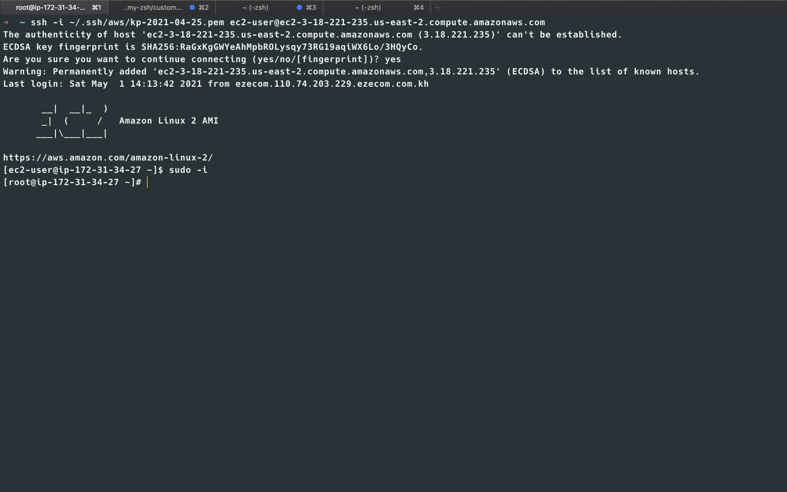
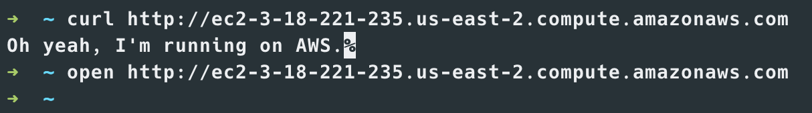
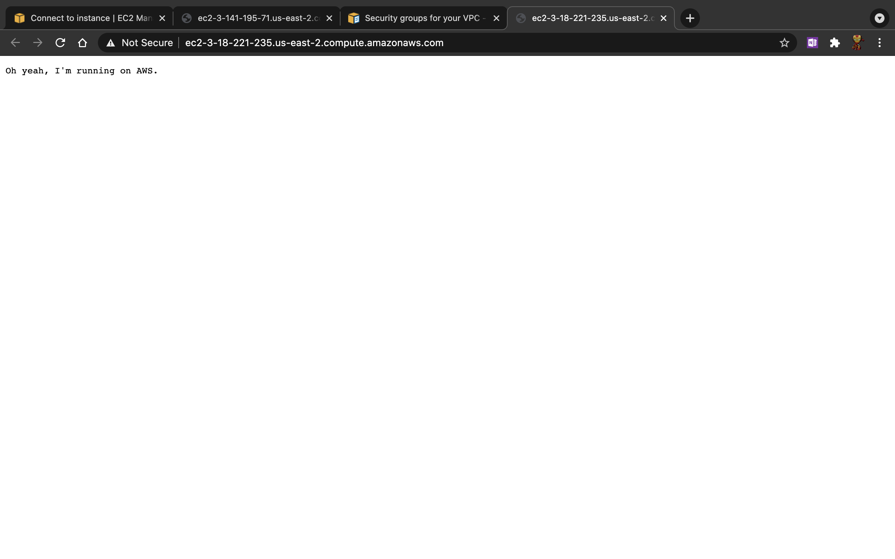

# 1. CREATE AWS INSTANCE
1. Login or signup new account if you not yet have one on [AWS Management Console](https://us-east-2.console.aws.amazon.com/console/home?region=us-east-2)
2. In the management console click on **Services** and go to **EC2**
3. You will be lead to *EC2 Dashboard* like below screenshot
   
   
4. click on **Launch instance**, then **Launch instance**
   
   
5. go for option **Amazon Linux 2**, then click **Select**
    
   
6. choose instance type as **t2.micro**, then click **Next: Configure Instance Details**
   
   
7. in this screen, we just keep everything as default and click **Next: Add Storage**
   
   
8. let use default storage and click **Next: Add Tags**
    
   
9. we don't have any tags for now, so just click **Next: Configure Security Group**
    
   
10. in this step, we can create new or select existing. I will select existing *default* one, then click on **Review and Launch**
    
    
11. now we need to create *key pair* for ssh connection by just simply enter a name and click on button **Download Key Pair**
        

11. wait for instance ready and *Running*
    
    
12. select the instance and click button **Connect** to see how to connect to instance, then go to tab **SSH client**
    copy the *Public DNS*
    
    
13. now we an ssh to that instance
    ```shell
    ssh -i ~/.ssh/aws/kp-2021-04-25.pem ec2-user@ec2-3-18-221-235.us-east-2.compute.amazonaws.com
    ```
    
14. switch user to root and make sure our OS is up-to-date
    ```shell
    sudo -i
    yum update -y
    ```
    

# 2. INSTALL GOLANG IN THAT INSTANCE (OPTIONAL)
1. Amazon Linux 2 is using Yum package manager, so we can install with ```yum``` command
    ```shell
    yum install -y golang
    ```
   
2. verify installation with command
    ```shell
    go version
    ```
3. now we need to configure ```go env```, this is default one
    ```shell
    go env
   ```
   ```shell
    GO111MODULE=""
    GOARCH="amd64"
    GOBIN=""  # this was not specified
    GOCACHE="/root/.cache/go-build"
    GOENV="/root/.config/go/env"
    GOEXE=""
    GOFLAGS=""
    GOHOSTARCH="amd64"
    GOHOSTOS="linux"
    GOINSECURE=""
    GOMODCACHE="/root/go/pkg/mod"
    GONOPROXY=""
    GONOSUMDB=""
    GOOS="linux"
    GOPATH="/root/go" # this directory not yet existed
    GOPRIVATE=""
    GOPROXY="https://proxy.golang.org,direct"
    GOROOT="/usr/lib/golang" #OK
    GOSUMDB="sum.golang.org"
    GOTMPDIR=""
    GOTOOLDIR="/usr/lib/golang/pkg/tool/linux_amd64"
    GCCGO="gccgo"
    AR="ar"
    CC="gcc"
    CXX="g++"
    CGO_ENABLED="1"
    GOMOD=""
    CGO_CFLAGS="-g -O2"
    CGO_CPPFLAGS=""
    CGO_CXXFLAGS="-g -O2"
    CGO_FFLAGS="-g -O2"
    CGO_LDFLAGS="-g -O2"
    PKG_CONFIG="pkg-config"
    GOGCCFLAGS="-fPIC -m64 -pthread -fmessage-length=0 -fdebug-prefix-map=/tmp/go-build807080367=/tmp/go-build -gno-record-gcc-switches"
    ```

4. edit ```.bash_profile``` to configure those variable
    ```shell
    vi .bash_profile
   ```
   ```shell
    # .bash_profile

    # Get the aliases and functions
    if [ -f ~/.bashrc ]; then
    . ~/.bashrc
    fi
    
    # User specific environment and startup programs
    
    GOPATH=$HOME/go
    GOBIN=$GOPATH/bin
    
    PATH=$PATH:$HOME/bin:$GOBIN
    
    export GOPATH
    export GOBIN
    export PATH
    ```
5. now check the ```go env``` again
    ```shell
    source .bash_profile
    go env
    ```
   we should now get below result:
    ```shell
    GO111MODULE=""
    GOARCH="amd64"
    GOBIN="/root/go/bin"
    GOCACHE="/root/.cache/go-build"
    GOENV="/root/.config/go/env"
    GOEXE=""
    GOFLAGS=""
    GOHOSTARCH="amd64"
    GOHOSTOS="linux"
    GOINSECURE=""
    GOMODCACHE="/root/go/pkg/mod"
    GONOPROXY=""
    GONOSUMDB=""
    GOOS="linux"
    GOPATH="/root/go"
    GOPRIVATE=""
    GOPROXY="https://proxy.golang.org,direct"
    GOROOT="/usr/lib/golang"
    GOSUMDB="sum.golang.org"
    GOTMPDIR=""
    GOTOOLDIR="/usr/lib/golang/pkg/tool/linux_amd64"
    GCCGO="gccgo"
    AR="ar"
    CC="gcc"
    CXX="g++"
    CGO_ENABLED="1"
    GOMOD=""
    CGO_CFLAGS="-g -O2"
    CGO_CPPFLAGS=""
    CGO_CXXFLAGS="-g -O2"
    CGO_FFLAGS="-g -O2"
    CGO_LDFLAGS="-g -O2"
    PKG_CONFIG="pkg-config"
    GOGCCFLAGS="-fPIC -m64 -pthread -fmessage-length=0 -fdebug-prefix-map=/tmp/go-build251791227=/tmp/go-build -gno-record-gcc-switches"
    ```
6. create go workspace directory
    ```shell
    mkdir ~/go
    cd $GOPATH
    mkdir src bin pkg
    mkdir -p src/github.com/SarathLUN/Go-Web-Programming/031-aws/01-hello
    cd src/github.com/SarathLUN/Go-Web-Programming/031-aws/01-hello
    ```
   
7. test go code
    ```shell
    cd src/github.com/SarathLUN/Go-Web-Programming/031-aws/01-hello
    vi main.go
    ```
   ```go
    package main

    import (
        "io"
        "net/http"
    )
    
    func main() {
        http.HandleFunc("/", index)
        http.ListenAndServe(":80", nil)
    }
    
    func index(w http.ResponseWriter, req *http.Request) {
        io.WriteString(w, "Oh yeah, I'm running on AWS.")
    }
    ```
   ```shell
    go run main.go
    |
    ```
8. at your client side, open the terminal and access to ```Go``` server
    ```shell
    curl http://ec2-3-18-221-235.us-east-2.compute.amazonaws.com
    ```
   you should get response as below:
   ```shell
    Oh yeah, I'm running on AWS.
    ```
   
   we can also test in browser:
    ```shell
    open http://ec2-3-18-221-235.us-east-2.compute.amazonaws.com
    ```
   you should get this:
    
# 3. BUILD, UPLOAD BINARY FILE TO AWS INSTANCE
1. build binary file for linux from localhost developer's PC. we will use same ```go``` code just for demo purpose.
   file ```main.go```
    ```go
    package main

    import (
        "io"
        "net/http"
    )
    
    func main() {
        http.HandleFunc("/", index)
        http.ListenAndServe(":80", nil)
    }
    
    func index(w http.ResponseWriter, req *http.Request) {
        io.WriteString(w, "Oh yeah, I'm running on AWS.")
    }
    ```
    ```shell
    GOOS=linux GOARCH=amd64 go build -o mybinary
    ```
   
2. upload binary file to AWS instance via ```scp```
    ```shell
    scp -i ~/.ssh/aws/kp-2021-04-25.pem ec2-user@ec2-3-18-221-235.us-east-2.compute.amazonaws.com:
    ```
   this will copy file to ```/home/ec2-user/mybinary```

3. now back to our ssh terminal and execute binary as root user
    ```shell
    ls -l
   chmode 700 mybinary
   sudo ./mybinary
    ```
   
4. now we should be able to access from client PC and get same result.
    ```shell
    open http://ec2-3-18-221-235.us-east-2.compute.amazonaws.com
    ```
    you should get this:
    