# 1. CREATE AWS INSTANCE
1. Login or signup new account if you not yet have one on AWS Management Console
2. In the management console click on **Services** and go to **EC2**
3. You will be lead to *EC2 Dashboard* like below screenshot
   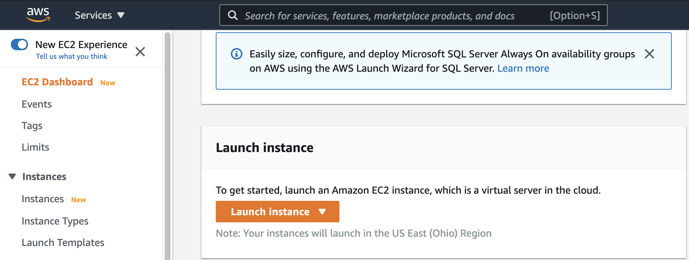
   
4. click on **Launch instance**, then **Launch instance**
   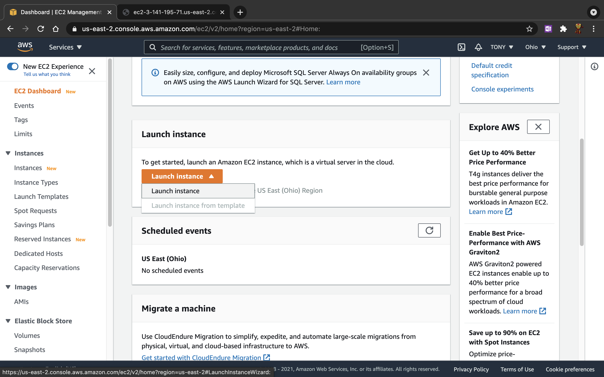
   
5. go for option **Amazon Linux 2**, then click **Select**
    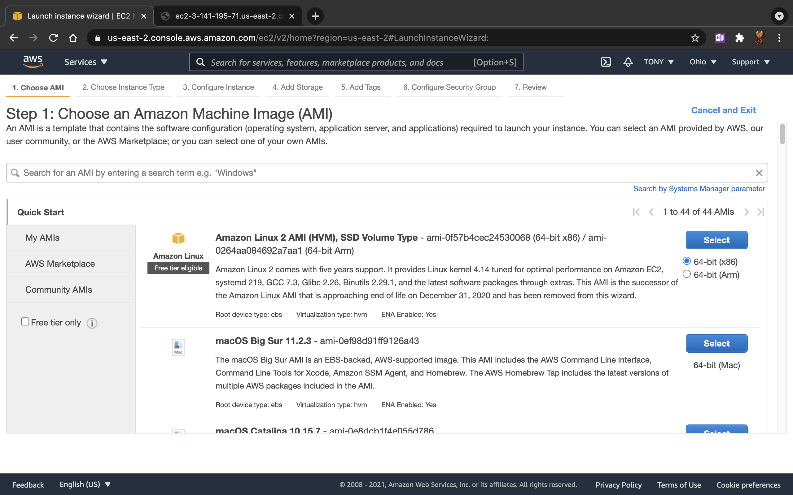
   
6. choose instance type as **t2.micro**, then click **Next: Configure Instance Details**
   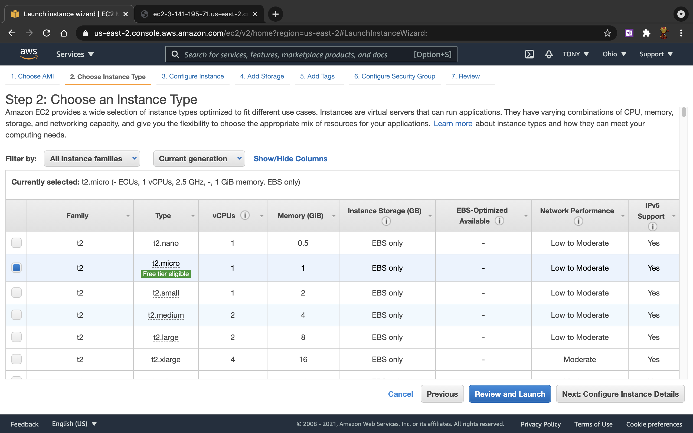
   
7. in this screen, we just keep everything as default and click **Next: Add Storage**
   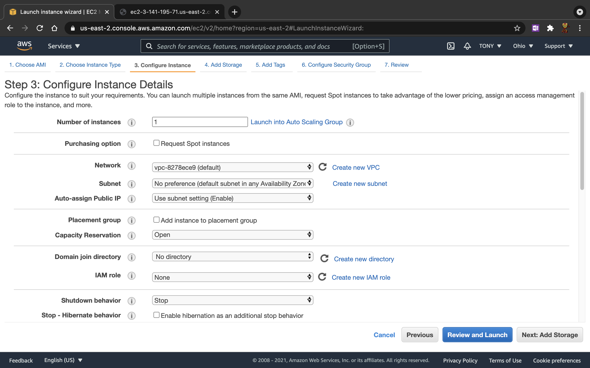
   
8. let use default storage and click **Next: Add Tags**
    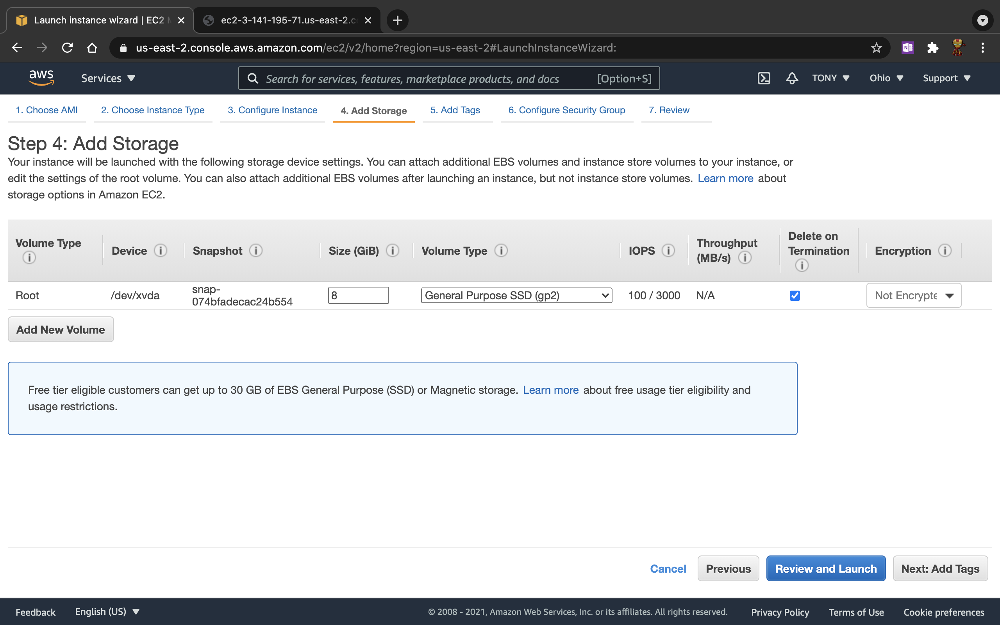
   
9. we don't have any tags for now, so just click **Next: Configure Security Group**
    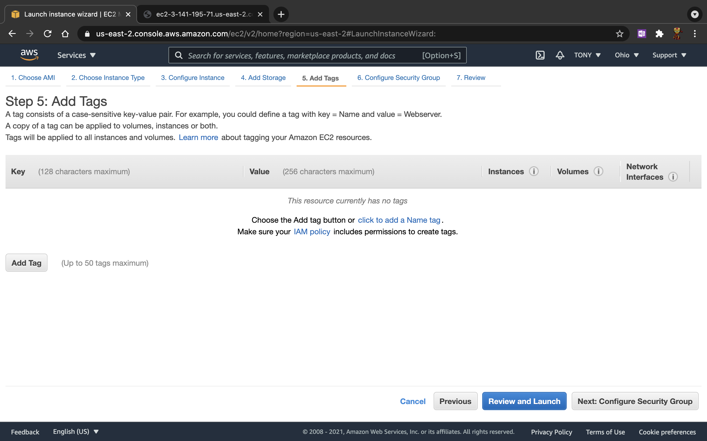
   
10. in this step, we can create new or select existing. I will select existing *default* one, then click on **Review and Launch**
    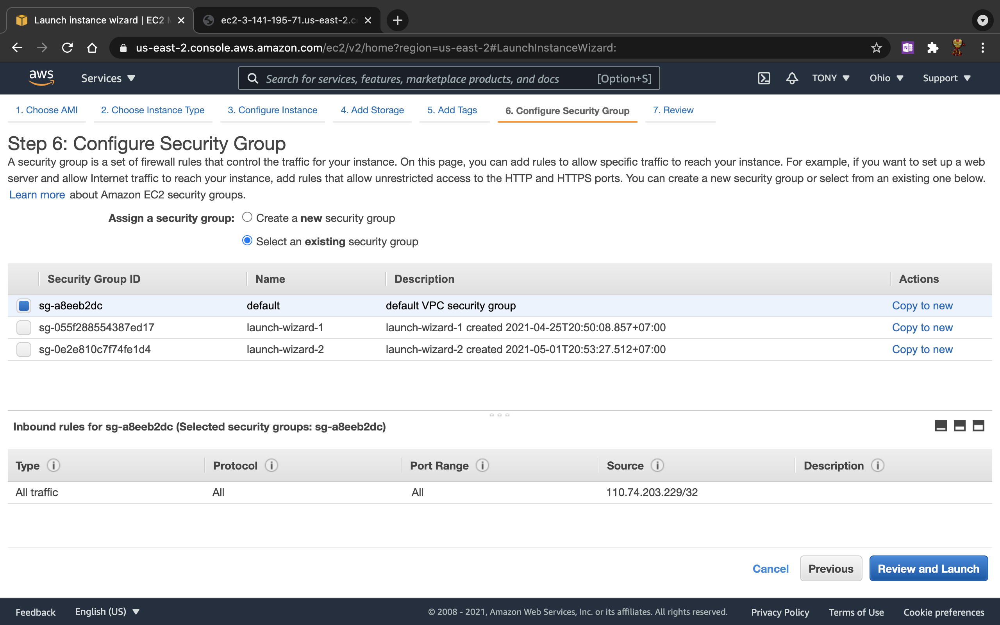
    
11. now we need to create *key pair* for ssh connection by just simply enter a name and click on button **Download Key Pair**
    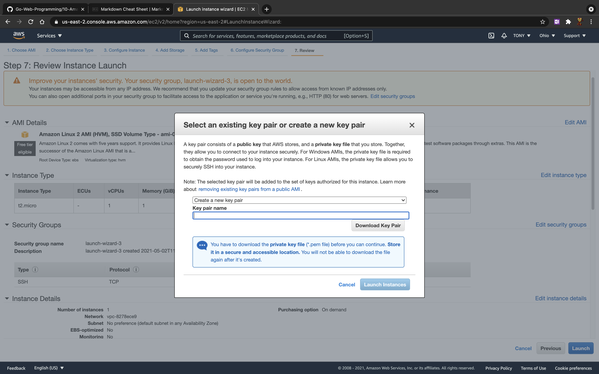    

11. wait for instance ready and *Running*
    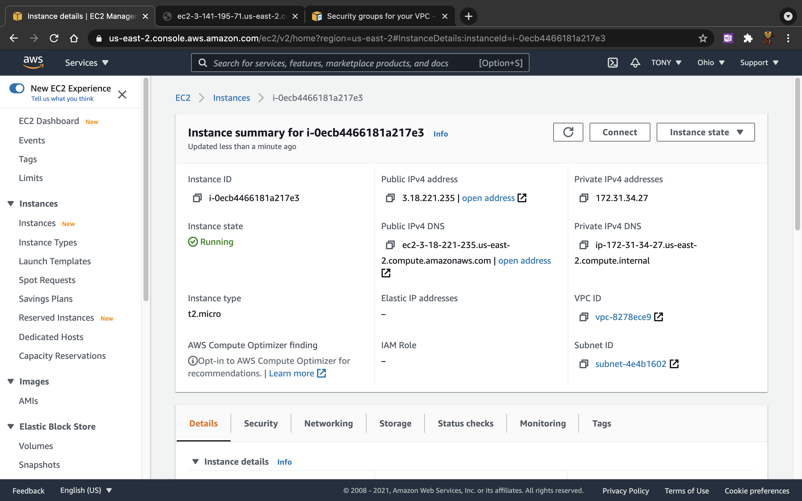
    
12. select the instance and click button **Connect** to see how to connect to instance, then go to tab **SSH client**
    copy the *Public DNS*
    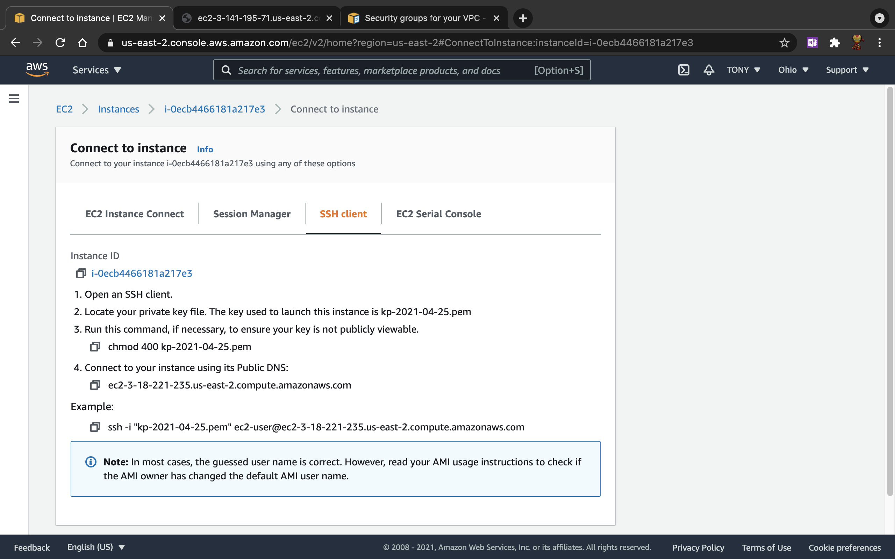
    
13. now we an ssh to that instance
    ```shell
    ssh -i ~/.ssh/aws/kp-2021-04-25.pem ec2-user@ec2-3-18-221-235.us-east-2.compute.amazonaws.com
    ```
    
14. switch user to root and make sure our OS is up-to-date
    ```shell
    sudo -i
    yum update -y
    ```

# 2. INSTALL GOLANG
# 3. BUILD, UPLOAD BINARY FILE TO AWS INSTANCE